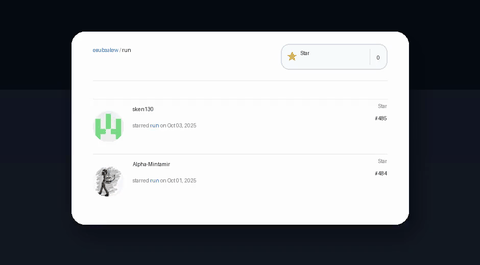

# star-growth

[](https://pypi.org/project/star-growth/)
[](https://github.com/esubaalew/star-growth/actions/workflows/publish.yml)

Turn your GitHub star growth into a scrolling MP4 or GIF animation with a single command-line tool.

## Install

```bash
pip install star-growth
```

FFmpeg is pulled in automatically through `imageio-ffmpeg`, but make sure your platform can build wheels for Pillow and MoviePy.

## Quick start

Run the CLI after installing the package:

```bash
star-growth --owner esubaalew --repo run
```

Short flags are available too. For example, the following writes a GIF preview:

```bash
star-growth -u esubaalew -r run -o stars.gif -f gif
```

The command fetches the latest stargazers, renders a GitHub-style card, and writes `star_growth.mp4` in the working directory.

By default the tool creates an MP4. Pass `-f gif` / `--format gif` (or end the `--output` value with `.gif`) to write an animated GIF instead. Only MP4 and GIF are currently supported.

### Popular options

- `-o stars.mp4` / `--output stars.mp4` – customise the export path (a numeric suffix prevents overwrites)
- `-f gif` / `--format gif` – export an animated GIF instead of an MP4
- `-s 2024-01-01` / `--start-date 2024-01-01` – only include stars on/after this UTC date (supports ISO 8601 timestamps)
- `-E 2024-01-31` / `--end-date 2024-01-31` – only include stars on/before this UTC date (full-day ranges when you omit a time)
- `-d 8` / `--duration 8` and `-p 24` / `--fps 24` – tune animation pacing
- `-m 30` / `--max-entries 30` – limit the number of rows rendered
- `-t "My stars"` / `--title "My stars"` – override the header label
- `-e linear` / `--easing linear` – swap the easing curve
- `-F frames/` / `--frames-dir frames/` – specify a directory for intermediate PNGs
- `-k` / `--keep-frames` – keep the intermediate PNGs after rendering
- `-T $TOKEN` / `--token $TOKEN` – use a GitHub personal access token
- `-w 5` / `--timeout 5` – shrink the GitHub request timeout
- `-R 5` / `--max-retries 5` – increase retry attempts
- `-b 1.5` / `--retry-backoff 1.5` – adjust retry backoff seconds
- `-a 8` / `--avatar-workers 8` – change avatar download concurrency
- `-q` / `--no-progress` – hide the frame rendering progress bar

Run `star-growth --help` or `star-growth --version` for more details.

## Sample output



[Watch the full MP4](docs/assets/run-stars.mp4) generated from the latest stargazers on [`esubaalew/run`](https://github.com/esubaalew/run).

## Use it from Python

```python
from star_growth import StarsAnimationConfig, generate_scrolling_stars

config = StarsAnimationConfig(
	owner="octocat",
	repo="Hello-World",
	output="stars.mp4",
)

video_path = generate_scrolling_stars(config)
print(f"Video saved to {video_path}")
```

Frames are written to a temporary directory and cleaned up automatically. Pass `cleanup_frames=False` (or `--keep-frames` on the CLI) to inspect them.

Set `output_format="gif"` (or `--format gif`) if you want to generate an animated GIF instead of an MP4. Other containers aren't supported today, so choose whichever suits the platform you're sharing on.

## Develop locally

```bash
python -m venv .venv
source .venv/bin/activate
pip install -e .[dev]
pytest
```

The editable install keeps the CLI (`star-growth`) in sync with your workspace changes.

## Release automation

Tags that follow the `v*` pattern trigger the `Release` GitHub Actions workflow. To publish to PyPI, add a repository secret named `PYPI_API_TOKEN` containing an API token created in your PyPI account ("Publish" scope). The workflow will build the wheel and source tarball and upload them to https://pypi.org/project/star-growth/.

## Troubleshooting

- **Missing avatars** – GitHub occasionally rate-limits avatar requests; initials placeholders are rendered when that happens.
- **Fonts look off** – Install `DejaVuSans` locally or update the font paths inside `star_growth/generator.py`.
- **Large repositories** – Provide a personal access token and raise `--max-retries` / `--retry-backoff` when you expect heavy traffic.

Be mindful of GitHub's terms of service and the privacy expectations of your stargazers when sharing renders.

## License

Released under the [Apache License 2.0](./LICENSE) by [Esubalew Chekol](https://github.com/esubaalew). See the upstream copy at [github.com/esubaalew/star-growth](https://github.com/esubaalew/star-growth) for the canonical license record.
